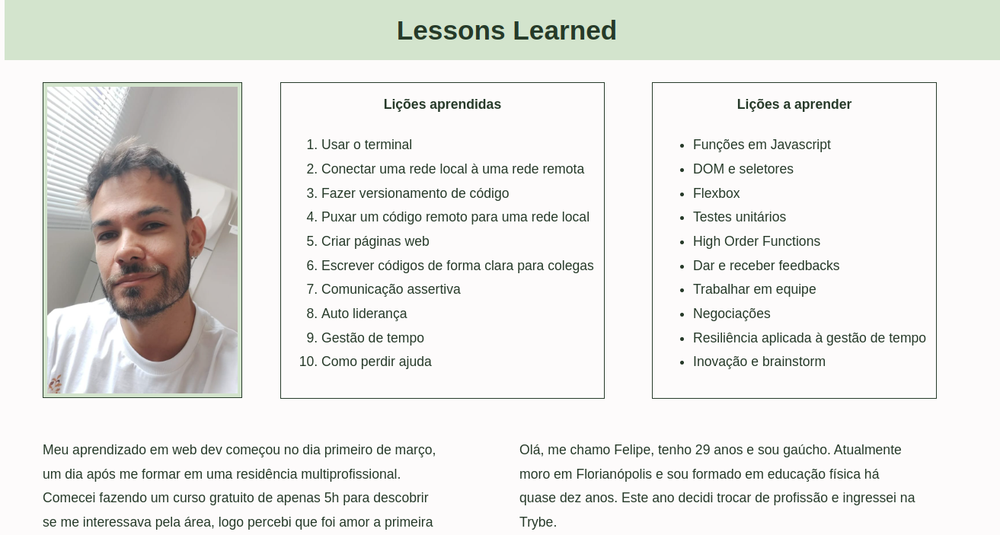

# README: Lessons learned



<br/>

In this project, I worked with lists and documented my personal growth while studying web development.

## Project Description

I used HTML and CSS in this project, aiming to showcase the skills I've acquired during a month of study and the skills I plan to learn soon. I also composed a brief biography detailing my career change.

### Project Structure

The project consists of a single HTML file (`index.html`) and a CSS  (`style.css`) for styling.

### Technologies

- LINUX
- VSCODE
- HTML
- CSS

### What I Learned

- How to work with lists
- How to use external links
- How to work with divs
- How to write semantic HTML using code sniffer


## How to Run the Project

1. Clone the repository:

   ```bash
   git clone https://github.com/feduarte-dev/exercise-functions
   ```

2. Navigate to the project directory:

   ```bash
   cd your-repository
   ```
   
3. Install dependencies:

   ```bash
   npm install
   ```

4. Right click index.html and open it with live server.

## Contributions

[Felipe](https://www.linkedin.com/in/feduarte-dev/) - HTML and CSS


[Trybe](https://www.betrybe.com/) - Everything else
